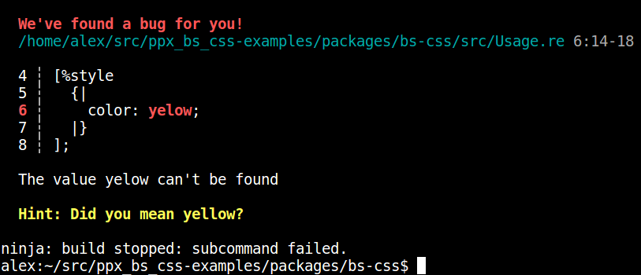
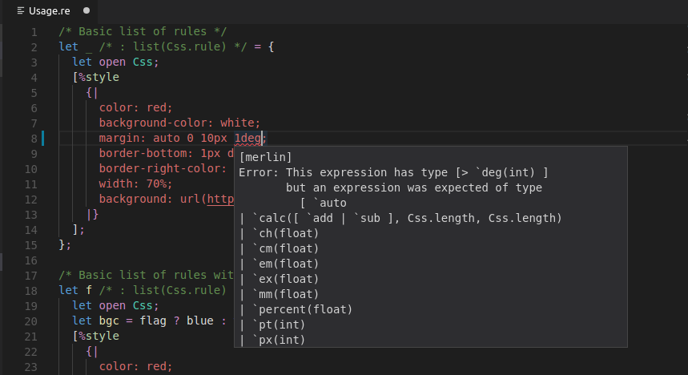
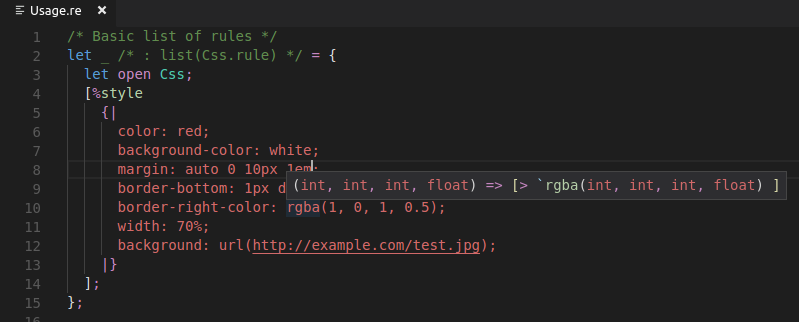

ppx\_bs\_css
============

A ppx rewriter for CSS expressions.

Parses a CSS string and produces a declaration block compatible with
[bs-css](https://github.com/SentiaAnalytics/bs-css), and
[typed-css-core](https://github.com/glennsl/bs-typed-css/tree/master/packages/core).

### Quick start

[ppx_bs_css_example](https://github.com/jchavarri/ppx_bs_css_example) by [jchavarri](https://github.com/jchavarri) provides
an easy to use template project that shows how to configure an [esy](https://esy.sh/) project that depends on `ppx_bs_css`.

### Build

    npm install -g esy
    esy install
    esy build
    # to build tests
    esy jbuilder build test/test_suite.exe
    # to run tests
    esy _build/default/test/test_suite.exe

### Usage

Add the PPX to your `bsconfig.json`:

```json
{
    "ppx-flags": [
        "ppx_bs_css.exe --as-ppx"
    ]
}
```

### Examples

Basic `bs-css` rules (ReasonML syntax):

```reason
/* rules has type list(Css.rule) */
let rules =
  let open Css;
  [%style
    {|
      color: red;
      background-color: white;
      margin: auto 0 10px 1em;
      border-bottom: thin dashed #eee;
      border-right-color: rgb(1, 0, 1);
      width: 70%;
      background: url(http://example.com/test.jpg)
    |}
  ];
```

`bs-css` rules with selectors (ReasonML syntax):

```reason
/* rules has type list(Css.rule) */
let css =
  let open Css;
  [%css
    {|
      {
        color: red;
      }

      :hover {
        color: blue;
      }
    |}
  ];
```

`bs-css` keyframes (ReasonML syntax):

```reason
let bounces =
  let open Css;
  [%style
    {|
      @keyframes {
        from { transform: scale(0.1, 0.1); opacity: 0.0; }
        60% { transform: scale(1.2, 1.2); opacity: 1.0; }
        to { transform: scale(1.0, 1.0); opacity: 1.0; }
      }
    |}
  ];
let bounce = List.hd(bounces);
let stylesWithAnimation =
  let open Css;
  [%style
    {|
      animation-name: bounce;
      animation-duration: 2000;
      width: 50px;
      height: 50px;
      background-color: rgb(255, 0, 0)
    |}
  ];
```

Basic `typed-glamor` declaration block (ReasonML syntax):

```reason
/* declarations has type list(TypedGlamor.Core.declaration) */
let declarations =
  let open TypedGlamor;
  [%style
    {typed|
      color: red;
      background-color: white;
      margin: auto 0 10px 1em;
      border-bottom: thin dashed #eee;
      border-right-color: rgb(1, 0, 1);
      width: 70%;
      background: url(http://example.com/test.jpg)
    |typed}
  ];
```

Selectors also work with `typed-glamor`. They need the `[%css]` extension instead of `[%style]`:

```reason
/* Selectors */
let _ = {
  let open TypedGlamor;
  [%css
    {typed|
      {
        color: red;
      }

      :hover {
        color: blue;
      }
    |typed}
  ];
};
```

See also:
[ppx_bs_css-examples](https://github.com/astrada/ppx_bs_css-examples).

### What you get

* Errors at compile time:



* Merlin support:





### What you don't get

* Autocomplete

